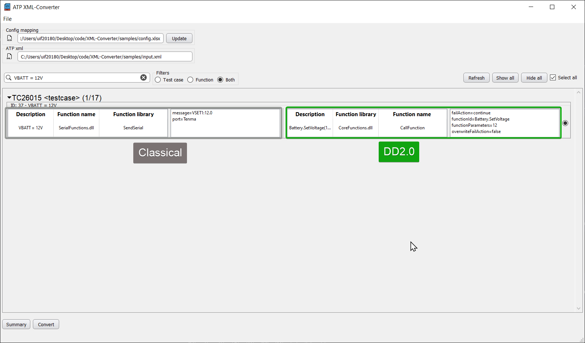

<h1 align="center">
   ATPxml converter app
</h1>
<p align="center">
  Continental internal tool for converting Automated test platform (ATP) XML files.
</p>


## Get started:

**Git**

To install and run your own copy of this first navigate to your desired directory clone the repository:

```
$ git clone https://github.com/bubuding0809/XML-Converter.git
$ cd XML-Converter
```

You will need python version 3 and above to run this application.

**Python**

Create a virtual enviroment to isolate project:

```
$ python3 -m venv env
```

_Feel free to create your virtual enviroment in the project root or somewhere else._

Activate virtual environment

```
// Windows
$ env/Scripts/activate

// macOS
$ source env/bin/activate
```

Install dependencies via requirement.txt

```
pip install -r requirements.txt
```

Run application:

```
python app.py
```

## Software stack used:

- Python Programming language
- PyQT GUI framework
